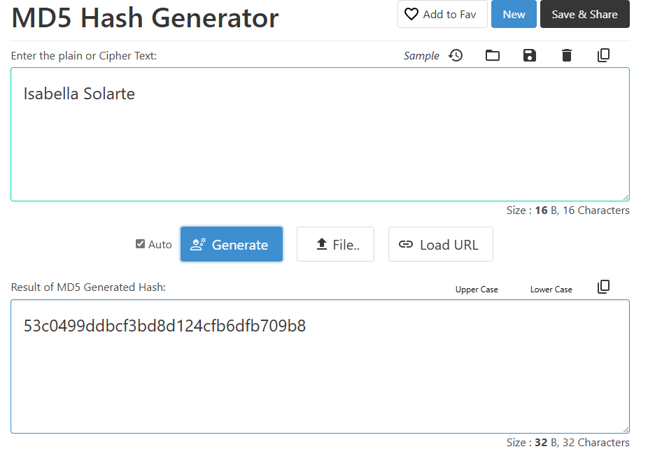

# FullStack-developer-candidates-tech-challenge-for-Junior

## Hash Generator´s result

## Challenge 1.

Having a list of n numbers with digits in range [0, S], where n <= 100, switch all list positions in O(n)
time.
If the input number contains a digit greater or equal than S, you will delete the digit from the
number, for example with S=6, 61 becomes 1, and 6 will be deleted from the array. The result
should be printed in console/terminal. Please, don’t use built-in sort of your language.
## Challenge 2.

Write a function that takes in a non-empty array of integers sorted in ascending order and returns a
new array of the same length with the squares of the original integers also sorted in ascending
order. If the output number is out of the range [0, SS] (for S=6 the range will be [0, 66]), you will
delete it of the output array. Please, don’t use built-in sort of your language.
## Challenge 3.

Given an array of positive integers representing the values of coins in your possession, write a
function that returns the minimum amount of change (the minimum sum of money) that you
CANNOT give change. The given coins can have any positive integer value and aren't necessarily
unique (i.e., you can have multiple coins of the same value). You can use built-in sort of your
language.
- Hint 1: 
One approach to solve this problem is to attempt to create every single amount of change, starting
at 1 and going up until you eventually can’t create an amount. While this approach works, there is
a better one.
- Hint 2: 
Start by sorting the input array. Since you’re trying to find the minimum amount of change that you
can’t create, it makes sense to consider the smallest coins first.
- Hint 3: 
To understand the trick to this problem, consider the following example: coins = [1, 2, 4]. With this
set of coins, we can create 1, 2, 3, 4, 5, 6, 7 cents worth of change. Now, if we were to add a coin of value 9 to this set, we would not be able to create 8 cents. However, if we were to add a coin of
value 7, we would be able to create 8 cents, and we would also be able to create all values of
change from 1 to 15. Why is this the case?
## Built With

- [![Python][Python-shield]][Python-link]
- [![visual Studio Code][VSCode-shield]][VSCode-link]

[Python-shield]: https://img.shields.io/badge/Python-3776AB?style=for-the-badge&logo=python&logoColor=white
[Python-link]: https://www.python.org/
[VSCode-shield]: https://img.shields.io/badge/Visual_Studio_Code-0078d7?style=for-the-badge&logo=visual%20studio%20code&logoColor=white
[VSCode-link]: https://code.visualstudio.com/

